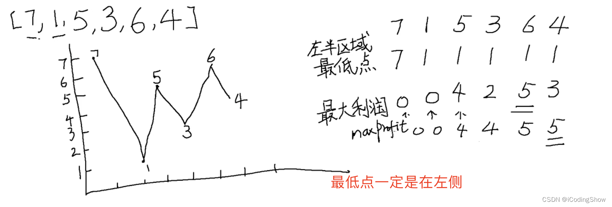

- [参考链接](#参考链接)
- [常见算法题](#常见算法题)
  - [移动零（美团）](#移动零美团)
  - [对象扁平化（字节）](#对象扁平化字节)
  - [无重复字符的最长子串（好未来）](#无重复字符的最长子串好未来)
  - [树](#树)
    - [列表转成树 \&\& 树转化为列表（面试题）](#列表转成树--树转化为列表面试题)
          - [题目1：输入上述列表，转化成树形结构；](#题目1输入上述列表转化成树形结构)
          - [题目2：上述树转化为列表](#题目2上述树转化为列表)
    - [二叉树前、中、后遍历套路详解](#二叉树前中后遍历套路详解)
    - [二叉树的最大深度](#二叉树的最大深度)
    - [树形结构查找节点](#树形结构查找节点)
    - [反转二叉树（陌陌）](#反转二叉树陌陌)
    - [数组转tree](#数组转tree)
  - [第一个不重复字符](#第一个不重复字符)
  - [版本号排序（汽车之家）](#版本号排序汽车之家)
  - [三数之和](#三数之和)
  - [数组对象根据另外一个数组排序（知乎）](#数组对象根据另外一个数组排序知乎)
  - [手写LRU算法（蔚来）](#手写lru算法蔚来)
  - [合并两个有序数组](#合并两个有序数组)
  - [翻转一个list的DOM（zoom二面）](#翻转一个list的domzoom二面)
  - [斐波那契数列](#斐波那契数列)
  - [回文的最大长度](#回文的最大长度)
- [leetcode算法题](#leetcode算法题)
    - [第一个不重复的字符](#第一个不重复的字符)
    - [字符串所有排列组合](#字符串所有排列组合)
    - [最长递增子序列](#最长递增子序列)
    - [最大子序和](#最大子序和)
    - [回文的最大长度](#回文的最大长度-1)
    - [搜索插入位置](#搜索插入位置)
    - [长度最小的子数组](#长度最小的子数组)
    - [最长回文子串](#最长回文子串)
    - [二叉树反转，然后再求出最深的层级的右侧节点的值(陌陌)](#二叉树反转然后再求出最深的层级的右侧节点的值陌陌)
    - [买卖股票问题](#买卖股票问题)
- [数组排序](#数组排序)
    - [时间复杂度和空间复杂度](#时间复杂度和空间复杂度)
    - [排序算法](#排序算法)
    - [1 冒泡排序](#1-冒泡排序)
    - [2 选择排序](#2-选择排序)
    - [3 插入排序](#3-插入排序)
    - [4 希尔排序](#4-希尔排序)
    - [5 快速排序](#5-快速排序)
    - [6、归并排序](#6归并排序)
    - [7 堆排序](#7-堆排序)
- [其他算法题](#其他算法题)
    - [1、给定两个数组，写一个方法来计算它们的交集。](#1给定两个数组写一个方法来计算它们的交集)
    - [2、统计 1 ~ n 整数中出现 1 的次数。](#2统计-1--n-整数中出现-1-的次数)
    - [3、不用加减乘除运算符，求整数的7倍](#3不用加减乘除运算符求整数的7倍)
    - [4、实现一个 sleep 函数](#4实现一个-sleep-函数)
    - [5、找出字符串中连续出现最多的字符和个数](#5找出字符串中连续出现最多的字符和个数)
    - [6、根据以下要求，写一个数组去重函数](#6根据以下要求写一个数组去重函数)
    - [7、打印出 1 - 10000 之间的所有对称数 例如 121、1331 等](#7打印出-1---10000-之间的所有对称数-例如-1211331-等)
    - [8、数组按连续分组](#8数组按连续分组)
    - [9、数组按照十等分分配](#9数组按照十等分分配)
    - [10、扑克牌问题](#10扑克牌问题)
    - [11、反转整数](#11反转整数)


# 参考链接
[万字总结 JS数据结构与常用的算法](https://juejin.cn/post/7094056264283471908#heading-69)
[20个常见的前端算法题，你全都会吗？](https://juejin.cn/post/7158730050718662687)
[leetcode最常见的150道前端面试题 --- 简单题上（44题）](https://juejin.cn/post/6987320619394138148)
[10万字前端知识体系总结（算法篇）](https://juejin.cn/post/7146975493278367752#heading-42)


# 常见算法题
## 移动零（美团）
原始值：[0, 1, 2, 0, 5, 8, 6, 0, 2, 7]   
结果：[0, 0, 0, 1, 2, 5, 8, 6, 2, 7]

```javascript
// 自己的解法：这个解法有待完善，如下
function sortArray(list) {
    // 边界条件判断
//     if(list.length === 0) {
//         return list;
//     }
    
    const length = list.length;
    // 倒序遍历
    for(let i = length - 1; i > 0; i--) {
        // 判断是否为零数字
        if(list[i] === 0) {
            console.log('123')
            list.splice(i, 1); // 删除0元素
            list.unshift(0); // 在数组前面添加0
            // i++; 这个注意
        }
    }
    return list;
}

sortArray([0, 1, 2, 0, 5, 8, 6, 0, 2, 7, 0, 0])

// 面试官建议的解法：双指针
var moveZeroes = function(nums) {
    let slowIndex = 0;
    for (let fastIndex = 0; fastIndex < nums.length; fastIndex++) {
        if (nums[fastIndex] !== 0) {
            [nums[slowIndex], nums[fastIndex]] = [nums[fastIndex], nums[slowIndex]];
            slowIndex++;
        }
    }
};
```

## 对象扁平化（字节）

原始值：`{ a: { b: { c: 1 } }, d: 2, e: [3, { f: 4, g: [5] }, [6, 7]], h: 8 }`   
要求输出：`{ "a.b.c": 1, d: 2, "e[0]": 3, "e[1].f": 4, "e[1].g[0]": 5, "e[2][0]": 6, "e[2][1]": 7, h: 8 }`

```javascript
function flatten(obj) {
    let res = {};
    function flat(cur, key = '', isArray = false) {
        for (let [k, v] of Object.entries(cur)) {
            if(Array.isArray(v)) {
                let temp = isArray ? key + "[" + k + "]" : key + k;
                flat(v, temp, true);
            } else if(typeof v === 'object') {
                let temp = isArray ? key + "[" + k + "]." : key + k + ".";
                flat(v, temp);
            } else {
                let temp = isArray ? key + "[" + k + "]" : key + k;
                res[temp] = v
            }
        }
    }
    flat(obj);
    return res;
}
```
https://blog.csdn.net/xiaomin_er/article/details/124383424
https://github.com/labuladong/fucking-algorithm

## 无重复字符的最长子串（好未来）
题目描述：给定一个字符串 s ，请你找出其中不含有重复字符的` 最长连续子字符串 `的长度。
输入: s = "abcabcbb" 
输出: 3  
解释: 因为无重复字符的最长子字符串是 "abc"，所以其长度为 3。
```javascript
// 方法1：
var lengthOfLongestSubstring = function(s) {
    let count = 0, l = 0;
    const map = new Map();
    // 以[l, r]为一个窗口
    for(let r = 0; r < s.length; r++) {
        // 遇到重复字符的时候把左指针移到前面的重复字符的下一位。
        //（相当于把前面的重复字符删除）
        // map.get(s[r]) >= l ，因为有可能有多个重复的值
        if(map.has(s[r]) && map.get(s[r]) >= l) {
            l = map.get(s[r]) + 1;
        }
        // 不重复
        count = Math.max(count, r - l + 1);
        map.set(s[r], r);
    }
    return count;
};


// 方法2：
var lengthOfLongestSubstring = function(s) {
    let count = 0, left = 0;
    const map = new Map();
    // 以[left, right]为一个窗口
    for(let right = 0; right < s.length; right++) {
        // 如果重复
        if(map.has(s[right])) {
            left = Math.max(left, map.get(s[right]) + 1); // 注意这段代码
        }
        // 不重复
        count = Math.max(count, right - left + 1);
        map.set(s[right], right);
    }
    return count;
};
```

## 树
### 列表转成树 && 树转化为列表（面试题）
题目1： 输入如下列表如下，转化成树形结构；
题目2： 将树形结构转化为列表；
如下：
```javascript
[
  { id: 1, title: "child1", parentId: 0 },
  { id: 2, title: "child2", parentId: 0 },
  { id: 3, title: "child1_1", parentId: 1 },
  { id: 4, title: "child1_2", parentId: 1 },
  { id: 5, title: "child2_1", parentId: 2 }
]

// 转化为：
tree = [
  {
    "id": 1,
    "title": "child1",
    "parentId": 0,
    "children": [
      {
        "id": 3,
        "title": "child1_1",
        "parentId": 1
      },
      {
        "id": 4,
        "title": "child1_2",
        "parentId": 1
      }
    ]
  },
  {
    "id": 2,
    "title": "child2",
    "parentId": 0,
    "children": [
      {
        "id": 5,
        "title": "child2_1",
        "parentId": 2
      }
    ]
  }
]
```

###### 题目1：输入上述列表，转化成树形结构；
**使用对象存储数据, 典型的空间换时间**，时间复杂度为O(n)、空间复杂度为O(n)，代码实现：
```javascript
// 列表转化为树
// 方法1：效率最高的一种方式
function listToTree(data) {
    // map来存储数据，res为最终结果
    const [map, res] = [{}, []];
    // 遍历原始数据data，存到map中，id为key，值为数据
    for (let item of data) {
        map[item.id] = item;
    }
    // 再次遍历data
    for (let i of data) {
        // 通过map获取每一项的parent的数据
        let parent = map[i.parentId];
        if(parent) {
            // 判断父节点的children是否存在，如果不存在设置初始值[], 存在直接push
            (parent.children || (parent.children = [])).push(i);
        } else {
            // parent找不到对应值，说明是根节点，直接插入到数组中
            res.push(i);
        }
    }
    return res;
}
```
###### 题目2：上述树转化为列表


广度优先遍历

```javascript
/**
 * 广度优先遍历
 * 队列  先进先出
 */
function wideTraversal(node) {
    let [stack, data] = [node, []];
    while (stack.length > 0) {
        let shift = stack.shift();
        data.push({
            id: shift.id,
            title: shift.title,
            parentId: shift.parentId
        })
        let children = shift.children;
        if(children) {
            for(let i = 0; i < children.length; i++){
                stack.push(children[i])
            }
        }
    }
    return data;
}
```
深度优先遍历


```javascript

/**
 * 树转数组扁平化结构   
 * 深度优先遍历  栈  后进先出
 */
function deepTraversal(node) {
	let [stack, res] = [node,[]];
	while(stack.length !== 0){
		let pop = stack.pop();
		res.push({
			id: pop.id,
			name: pop.name,
			parentId: pop.parentId
		})
		let children = pop.children;
		if(children){
			for(let i = children.length - 1; i >= 0; i--){
				stack.push(children[i]);
			}
		}
	}
	return res;
}
```
备注：另外还有递归方式实现，此处暂时省略,[JS算法之深度优先遍历(DFS)和广度优先遍历(BFS)](https://segmentfault.com/a/1190000018706578)
[JS 之深度优先遍历和广度优先遍历](https://workstudy.top/2020/11/17/JS-%E4%B9%8B%E6%B7%B1%E5%BA%A6%E4%BC%98%E5%85%88%E9%81%8D%E5%8E%86%E5%92%8C%E5%B9%BF%E5%BA%A6%E4%BC%98%E5%85%88%E9%81%8D%E5%8E%86/#%E6%A6%82%E5%BF%B5)

### 二叉树前、中、后遍历套路详解
```javascript
// 二叉树的后序遍历
var postorderTraversal = function(root) {
    const res = [];
    function traversal(root) {
        if(root !== null) {
            traversal(root.left);
            traversal(root.right);
            res.push(root.val); // 三者的区别在于res.push(root.val)的位置
        }
    }
    traversal(root);
    return res;
};

// 二叉树的前序遍历
// 二叉树的中序遍历
// 区别在于res.push(root.val)的位置
```

### 二叉树的最大深度
这个题在面试滴滴的时候遇到过，主要是掌握二叉树遍历的套路
- 只要遍历到这个节点既没有左子树，又没有右子树的时候，说明就到底部了，这个时候如果之前记录了深度，就可以比较是否比之前记录的深度大，大就更新深度
- 然后以此类推，一直比较到深度最大的
```javascript
var maxDepth = function(root) {
    if(!root) return root;
    let ret = 1;
    function dfs(root, depth){
        if(!root.left && !root.right) ret = Math.max(ret, depth);
        if(root.left) dfs(root.left, depth+1);
        if(root.right) dfs(root.right, depth+1);
    }
    dfs(root, ret);
    return ret
};

```
### 树形结构查找节点
题目： 查找树形结构中符合要求的节点
输入：
tree： 上文第11题生成的tree
func： data => data.title === "child2_1"
输出：{ id: 5, parentId: 2, title: "child2_1" }

```javascript
/**
* 查找节点
* @param {array} tree - 树
* @param {function} func - 查找条件
* */
function findTreeNode(tree, func) {
  if (!tree.length) return null;
  for (let i = 0; i < tree.length; i++) {
    // 条件成立 直接返回
    if (func(tree[i])) return tree[i];
    if (tree[i].children) {
      const res = findTreeNode(tree[i].children, func);
      // 结果存在再返回
      if (res) {
        return res;
      }
    }
  }
  return null;
}

// 测试
findTreeNode(tree, data => data.title === "child2_1")
```


### 反转二叉树（陌陌）
给定一棵二叉树的根节点 root，请左右翻转这棵二叉树，并返回其根节点。

```javascript
/**
 * @param {TreeNode} root
 * @return {TreeNode}
 */
var mirrorTree = function(root) {
    // 边界判断
    if(!root) {
        return root;
    }
    // 交换
    [root.left, root.right] = [root.right, root.left];
    mirrorTree(root.left);
    mirrorTree(root.right);
    return root;
};
```

### 数组转tree
输入：'[abc[bcd[def]]]'
结果：{"value":"abc","children":{"value":"bcd","children":{"value":"def"}}}
```javascript

// 先进行分割，然后使用reduce遍历实现
function normalize1(str) {
    var arr = str.split(/[\[\]]/g).filter(v => v);
    const res = {};
    arr.reduce((total, cur, index, self) => {
        total.value = cur;
        if(index !== self.length - 1) {
            total.children = {};
            return total.children;
        }
    }, res)
    return res;
}
console.log(normalize1('[abc[bcd[def]]]') )
```


## 第一个不重复字符
题目： 输入一个字符串，找到第一个不重复字符的下标
输入： 'abcabcde'
输出： 6
```javascript

```
## 版本号排序（汽车之家）
题目： 输入一组版本号，输出从大到小的排序

输入： ['2.1.0.1', '0.402.1', '10.2.1', '5.1.2', '1.0.4.5']

输出： ['10.2.1', '5.1.2', '2.1.0.1', '1.0.4.5', '0.402.1']


```javascript
// 思路：利用数组的sort方法，在sort中进行判断实现
function sortVersion(list) {
    return list.sort((a, b) => {
    	// 转化数组
        let arr1 = a.split('.').map(i => i * 1);
        let arr2 = b.split('.').map(i => i * 1);
        
        const maxLength = Math.max(arr1.length, arr2.length);
        // 以数组最长长度为遍历的基准
        for(let i = 0; i < maxLength; i++) {
            if((arr1[i] || 0) > (arr2[i] || 0)) {
                return 1;
            }
            if((arr1[i] || 0) < (arr2[i] || 0)) {
                return -1;
            }
        }
        return 0;
    })
}
```
## 三数之和
题目： 给定一个数组nums，判断 nums 中是否存在三个元素a，b，c，使得 a + b + c = target，找出所有满足条件且不重复的三元组合

输入： nums: [5, 2, 1, 1, 3, 4, 6] ；target:8

输出：[ [1, 1, 6], [1, 2, 5], [1, 3, 4] ]

```javascript
// 用双指针算法
// 注意：下面计算的是target为0的情况，如果算其他值，只需传入target即可
var threeSum = function(nums) {
    // 先将数组从小到大排序
    nums.sort((a, b) => a - b);
    const n = nums.length;
    let ans = [];

    // 循环到n-2，剩下两个留给另两个指针
    for (let i = 0; i < n - 2; i++) {
        // 跳过重复的arr[i]值, 比如[2, 1, 1],跳过第二个1
        if (i > 0 && nums[i] === nums[i - 1]) continue;
        // 如果target为其他值，下面的两行代码可不考虑
        if (nums[i] + nums[i + 1] + nums[i + 2] > 0) break; // 优化一
        if (nums[i] + nums[n - 2] + nums[n - 1] < 0) continue; // 优化二

        // 定义两个指针，初始位置：左指针为第二位，右指针为最后一位
        let j = i + 1, k = n - 1;
        
        while (j < k) {
            let sum = nums[i] + nums[j] + nums[k];
            if (sum > 0) k--;
            else if (sum < 0) j++;
            else {
                ans.push([nums[i], nums[j], nums[k]]);

                // 继续移动指针，还有其他元素满足条件
                j += 1;
                // 因为可能有多个重复的值，所有使用while遍历
                while(j < k && nums[j] === nums[j-1]) { // 跳过重复数字
                    j += 1;
                }

                k -= 1;
                while(k > j && nums[k+1] === nums[k]) { // 跳过重复数字
                    k -= 1;
                }
            }
        }
    }
    return ans;
};
```

## 数组对象根据另外一个数组排序（知乎）
数组对象根据另外一个数组排序
const array1 = [{value: 1}, {value: 2}, {value: 3}, {value: 1}];
const order = [2, 3, 1];
输出：
```javascript
// 输出结果
const b = [
  {
  "value": 2
  },
  {
  "value": 3
  },
  {
  "value": 1
  },
  {
  "value": 1
  }
]
```
思路：遍历order，过程中，根据value和每一项的值比较将array1数据进行分组，并将其存在map中，利用map的有序性进行排序。


```javascript
pending...
```

## 手写LRU算法（蔚来）

```javascript
// 手写LRU算法
class LRUCache {
  constructor(length) {
    this.length = length; // 存储长度
    this.data = new Map(); // 存储数据
  }
  // 存储数据，通过键值对的方式
  set(key, value) {
    const data = this.data;
    if (data.has(key)) {
      data.delete(key)
    }
    data.set(key, value);


    // 如果超出了容量，则需要删除最久的数据
    if (data.size > this.length) {
      const delKey = data.keys().next().value;
      data.delete(delKey);
    }
  }
  // 获取数据
  get(key) {
    const data = this.data;
    // 未找到
    if (!data.has(key)) {
      return null;
    }
    const value = data.get(key); // 获取元素
    data.delete(key); // 删除元素
    data.set(key, value); // 重新插入元素
  }
}
const lruCache = new LRUCache(5);

```
[面试官：请使用JS完成一个LRU缓存？](https://juejin.cn/post/7105654083347808263)


## 合并两个有序数组
思路：while两个数组长度，双指针，最后把剩下的数组进行合并。
```javascript
略
```

## 翻转一个list的DOM（zoom二面）
问题：给定一个DOM元素结构如下：
```html
<ul>
  <li/>
  <li/>
</ul>
```

```javascript
代码实现：
let ul = document.getElementById('ul')

function reverseChildNodes(node) {
  	//创建包装器
    let frag = document.createDocumentFragment();
  	//每次取出node节点的最后一个子节点
    while(node.lastChild) {
        //放入包装器中，domApi中取出节点的过程中也会将节点从原父节点中移除
      	//然后形成倒序结构
        frag.appendChild(node.lastChild)
    }
  	//将包装器挂在node节点之下,并于node融合
    node.appendChild(frag)
}

// 调用函数
reverseChildNodes(ul)
```

[由翻转DOM引发的学习DOMApi](https://juejin.cn/post/6844904001482293262)


## 斐波那契数列
题目： 从第3项开始，当前项等于前两项之和： 1 1 2 3 5 8 13 21 ……，计算第n项的值
输入： 10
输出： 89
```javascript
// 动态规划
// 使用动态规划，将复杂的问题拆分，也就是：`F(N) = F(N - 1) + F(N - 2)`，用数组将已经计算过的值存起来
// **`BigInt`** 是一种内置对象，它提供了一种方法来表示大于 `2^53 - 1` 的整数
function fib(n) {
  // 使用dp数组，将之前计算的结果存起来，防止栈溢出
  if (n < 2) return 1;
  let dp = [1n, 1n];
  for (let i = 2; i <= n; i++) {
    dp[i] = dp[i - 1] + dp[i - 2];
  }
  return dp[n];
}
```


## 回文的最大长度
在一个字符串中切除一部分，使得剩下的部分是回文，求这个回文的最大长度
思路：只能切除连续的一段，例如‘abbcfa’中切除从第四个到第五个字符，剩下‘abba’是回文，最大长度4。
因为截掉的字符串只有两种情况：
● 是原字符串中间的一部分
● 是原字符串左边或者右边的一部分
我的解法是，先把左右两边对称的部分排除，这一部分一定是回文串的一部分，长度记为res1，然后剩下的没排除的部分就一定是第二种情况了，这时候只要依次遍历每个分割点，找到最大长度的回文res2，res1与res2的和就是答案
链接：https://juejin.cn/post/7130274948001562661
```javascript

```
# leetcode算法题
### 第一个不重复的字符
题目： 输入一个字符串，找到第一个不重复字符的下标
输入： 'abcabcde'
输出： 6

```javascript
// 方法1：
function findOneStr(s) {
    let map = new Map();
    for (let i = 0; i < s.length; i++) {
        if(map.has(s[i])) {
            map.delete(s[i]);
        } else {
            map.set(s[i], i);
        }
    }
    // map获取第一个元素的value
    return map.values().next().value ? map.values().next().value : -1;
}

// 方法2：
// 时间复杂度O(n)、 空间复杂度O(n)
function findOneStr(str) {
  if (!str) return -1;
  // 使用map存储每个字符出现的次数
  let map = {};
  let arr = str.split("");
  arr.forEach(item => {
    let val = map[item];
    // val为undefined时，表示未存储，map[item] = 1；否则map[item] = val + 1
    map[item] = val ? val + 1 : 1;
  });
  // 再遍历一遍找到出现1次的下标
  for (let i = 0; i < arr.length; i++) {
    if (map[arr[i]] == 1) {
      return i;
    }
  }
  return -1;
}
```

### 字符串所有排列组合
题目： 输入一个字符串，打印出该字符串中，所有字符的排列组合
输入： 'abc'
输出： ['abc', 'acb', 'bca', 'bac', 'cab', 'cba']
```javascript
function stringGroup(s) {
    // 保存最终结果
    let res = [];
    // 先排序
    s = s.split('').sort((a, b) => a - b).join('');
    // 递归函数
    const dfs = (curr,store) => {
        // 是否满足条件添加
        if(!store.length) {
            return res.push(curr);
        }
        for (let i = 0; i < store.length; i++) {
            // 优化
            if(i > 0 && store[i] === store[i-1]) {
                continue;
            }
            // 递归 dfs
            dfs(curr + store[i], store.slice(0, i) + store.slice(i + 1));
        }
    }
  
    dfs('', s);
    return res;
}
stringGroup('abc')

// 备注：`slice的第二个参数也是下标，不包括这个下标`
```

### 最长递增子序列
题目： 一个整数数组 nums，找到其中一组最长递增子序列的值
输入： [3,5,7,1,2,8]
输出： [3,5,7,8]
```javascript
// 动态规划
var lengthOfLIS = function(nums) {
    const dp = new Array(nums.length).fill(1);
    for(let i = 0; i < nums.length; i++) {
        // i与i前面的元素进行比较
        for(let j = 0; j < i; j++) {
            // 找比i小的元素，找到一个，就让当前序列的最长子序列长度加1
            if(nums[i] > nums[j]) {
                dp[i] = Math.max(dp[i], dp[j] + 1);
            }
        }
    }
    return Math.max(...dp);
};
```

### 最大子序和
给定一个整数数组 nums ，找到一个具有最大和的连续子数组（子数组最少包含一个元素），返回其最大和。  
示例 1：

输入：nums = [-2,1,-3,4,-1,2,1,-5,4]
输出：6
解释：连续子数组 [4,-1,2,1] 的和最大，为 6 。

### 回文的最大长度
在一个字符串中切除一部分，使得剩下的部分是回文，求这个回文的最大长度
思路：只能切除连续的一段，例如‘abbcfa’中切除从第四个到第五个字符，剩下‘abba’是回文，最大长度4。
因为截掉的字符串只有两种情况：
● 是原字符串中间的一部分
● 是原字符串左边或者右边的一部分
我的解法是，先把左右两边对称的部分排除，这一部分一定是回文串的一部分，长度记为res1，然后剩下的没排除的部分就一定是第二种情况了，这时候只要依次遍历每个分割点，找到最大长度的回文res2，res1与res2的和就是答案
链接：https://juejin.cn/post/7130274948001562661


### 搜索插入位置
给定一个排序的整数数组 nums 和一个整数目标值 target ，请在数组中找到 target ，并返回其下标。如果目标值不存在于数组中，返回它将会被按顺序插入的位置。
请必须使用时间复杂度为 O(log n) 的算法。
示例 1:
输入: nums = [1,3,5,6], target = 5
输出: 2
```javascript
// 二分查找
var searchInsert = function(nums, target) {
    let left = 0, right = nums.length - 1, res = nums.length;
    while(left <= right) {
        let middle = Math.floor((left + right) / 2);
        if(nums[middle] >= target) {
            res = middle;
            right = middle - 1;
        } else {
            left = middle + 1;
        }
    }
    return res;
};
```

### 长度最小的子数组
给定一个含有 n 个正整数的数组和一个正整数 target 。
找出该数组中满足其和 ≥ target 的长度最小的 连续子数组 [numsl, numsl+1, ..., numsr-1, numsr] ，并返回其长度。如果不存在符合条件的子数组，返回 0 。
示例 1：
输入：target = 7, nums = [2,3,1,2,4,3]
输出：2
解释：子数组 [4,3] 是该条件下的长度最小的子数组。
```javascript
var minSubArrayLen = function(target, nums) {
  let left = 0,
    sum = 0;
  let minLength = Number.MAX_VALUE;
  for (let right = 0; right < nums.length; right++) {
    // 由于数组中的所有数字都是正整数，因此在子数组中添加新的数字能得到更大的子数组之和
    sum += nums[right];
    // sum>=target 已经是找到了可行解了
    while (left <= right && sum >= target) {
      //  移动左边界，在可行解里面寻找最优解
      minLength = Math.min(minLength, right - left + 1);
      sum -= nums[left++];
    }
  }
  return minLength == Number.MAX_VALUE ? 0 : minLength;
};
```
[链接](https://leetcode.cn/problems/2VG8Kg/solutions/1028286/jian-zhi-offer-zhuan-xiang-tu-po-ban-shu-1epd/)


### 最长回文子串
给你一个字符串 s，找到 s 中最长的回文子串。
如果字符串的反序与原始字符串相同，则该字符串称为回文字符串。
示例 1：
输入：s = "babad"
输出："bab"
解释："aba" 同样是符合题意的答案。
解题思路
● 两种情况：一种是回文子串长度为奇数（如aba，中心是b） 另一种回文子串长度为偶数（如abba，中心是b，b）；
● 循环遍历字符串 对取到的每个值 都假设他可能成为最后的中心进行判断；
```javascript
/**
 * @param {string} s
 * @return {string}
 */
var longestPalindrome = function(s) {
        if (s.length<2){
            return s
        }
        let res = ''
        for (let i = 0; i < s.length; i++) {
            // 回文子串长度是奇数
            helper(i, i)
            // 回文子串长度是偶数
            helper(i, i + 1) 
        }

        function helper(m, n) {
            while (m >= 0 && n < s.length && s[m] == s[n]) {
                m--
                n++
            }
            // 注意此处m,n的值循环完后  是恰好不满足循环条件的时刻
            // 此时m到n的距离为n-m+1，但是mn两个边界不能取 所以应该取m+1到n-1的区间  长度是n-m-1
            if (n - m - 1 > res.length) {
                // slice也要取[m+1,n-1]这个区间 
                res = s.slice(m + 1, n)
            }
        }
        return res
};
```
[链接](https://leetcode.cn/problems/longest-palindromic-substring/solutions/697935/chao-jian-dan-de-zhong-xin-kuo-san-fa-yi-qini/)

### 二叉树反转，然后再求出最深的层级的右侧节点的值(陌陌)


### 买卖股票问题
题目： 给定一个整数数组，其中第 i 个元素代表了第 i天的股票价格；
非负整数 fee 代表了交易股票的手续费用，求返回获得利润的最大值
输入： arr: [1, 12, 13, 9, 15, 8, 6, 16]； fee: 2
输出： 22

注意：下图是leetcode的121. 买卖股票的最佳时机的解题思路


[✅此外，这个链接可以参考思路](https://leetcode.cn/problems/best-time-to-buy-and-sell-stock-ii/description/)

```javascript
// 贪心算法
// 思路：当天的价格和第二天进行比较，如果递增就相加，如果递减就不管，按照每天的形式进行计算
var maxProfit = function(prices) {
    // 边界处理
    if(prices.length === 0) {
        return 0;
    }
    let maxProfit = 0;
    for(let i = 0; i < prices.length - 1; i++) {
        if(prices[i] < prices[i+1]) {
            maxProfit += prices[i+1] - prices[i];
        }
    }
    return maxProfit;
};


// 方法2
// 思路：找到向上的趋势，然后低点买，高点卖
var maxProfit = function(prices) {
    // 边界处理
    if(prices.length === 0) {
        return 0;
    }
    // min定义谷底，max定义谷峰
    let maxProfit = 0, min = 0, max = 0;
    let i = 0;
    while(i < prices.length - 1) {
        // 防止越界。并且如果是递减
        while(i < prices.length - 1 && prices[i] >= prices[i+1]) {
            i++;
        }
        min = prices[i];
        // 如果是递增
        while(i < prices.length - 1 && prices[i] <= prices[i+1]) {
            i++;
        }
        max = prices[i];
        maxProfit += max - min;
    }
    return maxProfit;
};
```

**买卖股票的最佳时机2**
给定一个数组 prices ，其中 prices[i] 是一支给定股票第 i 天的价格。
设计一个算法来计算你所能获取的最大利润。你可以尽可能地完成更多的交易（多次买卖一支股票）。
注意：你不能同时参与多笔交易（你必须在再次购买前出售掉之前的股票）。  

```javascript
// 思路：也就是说只要今天减去昨天，是正数就是利润
var maxProfit = function(prices) {
  let result = 0
  for(let i = 1; i < prices.length; i++){
      if(prices[i] > prices[i-1]){
          result += prices[i] - prices[i - 1]
      }
  }
  return result
};
```


# 数组排序
### 时间复杂度和空间复杂度


### 排序算法

> 巧记：
> 插帽龟 它很稳，插帽龟喜欢选帽插，插气就慌（方）了；
> 快归堆，n老 => nlogN


### 1 冒泡排序
这个算法的名字由来是因为越小的元素会经由交换慢慢“浮”到数列的顶端。
```javascript
// [5, 4, 3, 2, 1]
function bubbleSort(arr) {
    const len = arr.length;
    for (let i = 0; i < len - 1; i++) {
        for (let j = 0; j < len - 1 - i; j++) {
            if (arr[j] > arr[j + 1]) { // 相邻元素两两对比
                [arr[j], arr[j + 1]] = [arr[j + 1], arr[j]];
            }
        }
    }
    return arr;
}
```
改进： 加个标识，如果已经排好序了就直接跳出循环。 

### 2 选择排序
选择排序(Selection-sort)的工作原理：<font color="#c7244e">首先在未排序序列中找到最小（大）元素，存放到排序序列的起始位置，然后，再从剩余未排序元素中继续寻找最小（大）元素，然后放到已排序序列的末尾。以此类推，直到所有元素均排序完毕。</font>

```javascript
// [5, 4, 3, 2, 1]
function selectionSort(arr) {
    const len = arr.length;
    let minIndex;
    for (let i = 0; i < len - 1; i++) { // 数组的每一项，从而控制循环次数
        minIndex = i;
        for (let j = i + 1; j < len; j++) { // 一开始拿5和后面的值比较，遍历数组后面的值
            if (arr[minIndex] > arr[j]) { // 寻找最小的数
                minIndex = j; // 将最小数的索引保存
            }
        }
        // 将最小值和当前值进行交换
        [arr[minIndex], arr[i]] = [arr[i], arr[minIndex]];
    }
    return arr;
}
```

### 3 插入排序
插入排序（Insertion-Sort）工作原理是<font color="#c7244e">通过构建有序序列，对于未排序数据，在已排序序列中从后向前扫描，找到相应位置并插入。</font>

```javascript
// [3, 7, 2, 9, 4， 8， 1]
function insertionSort(arr) {
    const len = arr.length;
    let preIndex, current;
    for (let i = 1; i < len; i++) {
        preIndex = i - 1; // 倒序，从当前元素向后倒序依次比较
        current = arr[i];
        while (preIndex >= 0 && current < arr[preIndex]) {
            arr[preIndex + 1] = arr[preIndex]; // 将大于当前值的数都往后移动一位
            preIndex--;
        }
        arr[preIndex + 1] = current; // 跳出while循环之后，将当前比较值进行插入
    }
    return arr;
}
```
[详细介绍](https://www.bilibili.com/video/BV1yK4y1u7BU/?spm_id_from=333.337.search-card.all.click&vd_source=6223af80f0d3af90c7943b1db211f730)

### 4 希尔排序
第一个突破O(n2)的排序算法，是简单插入排序的改进版。它与插入排序的不同之处在于，它会优先比较距离较远的元素。希尔排序又叫缩小增量排序。
1
### 5 快速排序
快速排序使用<font color="#c7244e">分治法</font>来把一个串（list）分为两个子串（sub-lists）。具体算法描述如下：
- 从数列中挑出一个元素，称为 “基准”（pivot）； 	
- 重新排序数列，所有元素比基准值小的摆放在基准前面，所有元素比基准值大的摆在基准的后面（相同的数可以到任一边）。在这个分区退出之后，该基准就处于数列的中间位置。这个称为分区（partition）操作； 	
- 递归地（recursive）把小于基准值元素的子数列和大于基准值元素的子数列排序。 	
```javascript
function quickSort(list) {
  // 当list.length <= 1时，退出递归
  if (list.length <= 1) return list;
  // 找到中间节点
  let mid = Math.floor(list.length / 2);
  // 以中间节点为基准点，比该节点大的值放到right数组中，否则放到left数组中
  let base = list.splice(mid, 1)[0];
  let left = [];
  let right = [];
  list.forEach(item => {
    if (item > base) {
      right.push(item);
    } else {
      left.push(item);
    }
  });
  // 重新组合数组
  return quickSort(left).concat(base, quickSort(right));
}
```

### 6、归并排序
归并排序是采用<font color="#c7244e">分治法</font>（Divide and Conquer）的一个非常典型的应用。将已有序的子序列合并，得到完全有序的序列；<font color="#c7244e">即先使每个子序列有序，再使子序列段间有序。若将两个有序表合并成一个有序表，称为2-路归并。</font>

```javascript
1function mergeSort(arr) {
    var len = arr.length;
    if (len < 2) {
        return arr;
    }
    var middle = Math.floor(len / 2),
        left = arr.slice(0, middle),
        right = arr.slice(middle);
    return merge(mergeSort(left), mergeSort(right));
}

function merge(left, right) {
    var result = [];

    while (left.length > 0 && right.length > 0) {
        if (left[0] <= right[0]) {
            result.push(left.shift());
        } else {
            result.push(right.shift());
        }
    }

    while (left.length) {
        result.push(left.shift());
    }

    while (right.length) {
        result.push(right.shift());
    }
    return result;
}
```
### 7 堆排序

# 其他算法题

### 1、给定两个数组，写一个方法来计算它们的交集。
例如：给定 nums1 = [1, 2, 2, 1]，nums2 = [2, 2]，返回 [2, 2]。
```javascript

// 下面方式有弊端
let intersection = (...arg) => arg[0].filter(v => arg[1].includes(v));
// 解法有点问题，intersection([1,2,2,1],[2,1]) // [1, 2, 2, 1]
// 不能直接使用new Set去重，看下面的例子

// 其他合理方式：
const intersect = (nums1, nums2) => {
  const map = {}
  const res = []
  // 遍历第一个数组，用map保存，key为数组中的每一项，value为重复的个数
  for (let n of nums1) {
    if (map[n]) {
      map[n]++
    } else {
      map[n] = 1
    }
  }
  // 遍历第二个数组，如果map中有这个值，则把这个值保存到目标数组中，并将map中减1
  for (let n of nums2) {
    if (map[n] > 0) {
      res.push(n)
      map[n]--
    }
  }
  return res
}

intersect([1,2,2,1], [2,1, 1])
// [2, 1, 1]
```

### 2、统计 1 ~ n 整数中出现 1 的次数。
例如统计 1 ~ 400W 出现 1 的次数。
```javascript
function findOne(n) {
	let count = 0;
	for(let i = 0;i <= n;i++){
		count += String(i).split('').filter(item => item === '1').length
	}
	return count;
}
```

### 3、不用加减乘除运算符，求整数的7倍
```javascript
function getSevenNum(n = 0) { return (n << 3) - n }

getSevenNum() // 0
getSevenNum(1) // 7
getSevenNum(11) //77
```

1 << 1为2，1 << 2为4，1 << 3 为8。。。

### 4、实现一个 sleep 函数
实现一个 sleep 函数，比如 sleep(1000) 意味着等待1000毫秒，可从 Promise、Generator、Async/Await 等角度实现
```javascript
// Promise写法
const sleep = (time) => {
  return new Promise(resolve => {
    setTimeout(resolve, time);
  })
}
sleep(1000).then(() => console.log('开始搞事情~'))

// async/await写法
const sleep = async (time) => {
  await new Promise(resolve => {
    setTimeout(resolve, time)
  })
  console.log('开始搞事情~')
}
// sleep(1000);
```

### 5、找出字符串中连续出现最多的字符和个数
'abcaakjbb' => {'a':2,'b':2} 'abbkejsbcccwqaa' => {'c':3}
注意：题目说的是连续出现，注意连续二字
```javascript
// 一次遍历，按照这个可以在完善
function findLongest(str) {
  if (!str) return {};

  let count = 0;
  let maxCount = 0;
  let cur = str[0];
  let res = {};

  for (let i = 0; i < str.length; i++) {
    const s = str[i];
    if (s === cur) {
      count++;
      if (count > maxCount) {
        res = { [s]: count }
        maxCount = count;
      }
      if (count === maxCount) {
        res[s] = count;
      }
    } else {
      count = 1;
      cur = s;
    }
  }

  return res;
}

findLongest( 'abbkejsbcccwqaa')
```
[链接](https://github.com/Advanced-Frontend/Daily-Interview-Question/issues/220)

### 6、根据以下要求，写一个数组去重函数
1. 如传入的数组元素为`[123, "meili", "123", "mogu", 123]，则输出：[123, "meili", "123", "mogu"]`
2. 如传入的数组元素为`[123, [1, 2, 3], [1, "2", 3], [1, 2, 3], "meili"]，则输出：[123, [1, 2, 3], [1, "2", 3], "meili"]`
3. 如传入的数组元素为`[123, {a: 1}, {a: {b: 1}}, {a: "1"}, {a: {b: 1}}, "meili"]，则输出：[123, {a: 1}, {a: {b: 1}}, {a: "1"}, "meili"]`
```javascript
// 利用map，如果对同一个键多次赋值，后面的值将覆盖前面的值。
// 利用JSON.stringify作为key
function filterMap (arr) {
    var Map103 = new Map();
    arr.forEach(item => {
        Map103.set(JSON.stringify(item), item)
    })
    return [...Map103.values()]
}

console.log(filterMap([123, "meili", "123", "mogu", 123]))
console.log(filterMap([123, [1, 2, 3], [1, "2", 3], [1, 2, 3], "meili"]))
console.log(filterMap([123, {a: 1}, {a: {b: 1}}, {a: "1"}, {a: {b: 1}}, "meili"]))
```
[链接](https://github.com/Advanced-Frontend/Daily-Interview-Question/issues/215)

### 7、打印出 1 - 10000 之间的所有对称数 例如 121、1331 等
```javascript
[...Array(10000).keys()].filter((x) => { 
  return x.toString().length > 1 && x === Number(x.toString().split('').reverse().join('')) 
})


// 优化，不需要遍历所有的, 很难想到
let result = []
for(let i = 1; i < 10; i++){
    result.push(i)
    result.push(i * 11)
    for(let j = 0;j < 10;j++){
        result.push(i * 101 + j * 10)
        result.push(i * 1001 + j * 110)
    }
}
```

### 8、数组按连续分组
输入：[1, 2, 3, 5, 7, 8, 10]，输出：'1~3, 5, 7~8, 10'
如果连续数字的话，就取连续的第一个数和最后一个数，中间用~隔开。如果不连续就用，隔开。
```javascript
const nums1 = [1, 2, 3, 5, 7, 8, 10];

function simplifyStr(num) {
  var result = [];
  var temp = num[0];
  num.forEach((value, index) => {
    if (value + 1 !== num[index + 1]) {
      if (temp !== value) {
        result.push(`${temp}~${value}`)
      } else {
        result.push(`${value}`)
      }
      temp = num[index + 1];
    }
  })
  return result;
}

console.log(simplifyStr(nums1).join(','))
```

### 9、数组按照十等分分配
随机生成一个长度为 10 的整数类型的数组，例如 [2, 10, 3, 4, 5, 11, 10, 11, 20]，将其排列成一个新数组，要求新数组形式如下，例如 [ [2, 3, 4, 5], [10, 11], [20] ]。
```javascript
// 只有一个核心思想，放入hash表
let obj = {};
initArr.map((i) => {
    const intNum = Math.floor(i / 10);
    if (!obj[intNum]) obj[intNum] = [];
    obj[intNum].push(i);
})

// 输出结果
const resArr = [];
for(let i in obj) {
    resArr.push(obj[i]);
}
console.log(resArr);
```
[链接](https://github.com/Advanced-Frontend/Daily-Interview-Question/issues/113)

### 10、扑克牌问题
有一堆扑克牌，将牌堆第一张放到桌子上，再将接下来的牌堆的第一张放到牌底，如此往复；
最后桌子上的牌顺序为： (牌底) 1,2,3,4,5,6,7,8,9,10,11,12,13 (牌顶)；
问：原来那堆牌的顺序，用函数实现。
```javascript
function reverse(arr) {
  let i = 1
  let result = []
  while (arr.length) {
    if (i % 2) {
      result.unshift(arr.pop())
    } else {
      result.unshift(result.pop())
    }
    i++
  }
  return result
}

reverse([1,2,3,4,5,6,7,8,9,10,11,12,13 ])
// [1, 12, 2, 8, 3, 11, 4, 9, 5, 13, 6, 10, 7]
```

[链接](https://github.com/Advanced-Frontend/Daily-Interview-Question/issues/245)

### 11、反转整数
给定一个 32 位有符号整数，将整数中的数字进行反转。
示例 1:
输入: 123
输出: 321

 示例 2:
输入: -123
输出: -321

示例 3:
输入: 120
输出: 21

注意:
假设我们的环境只能存储 32 位有符号整数，其数值范围是 [−231,  231 − 1]。根据这个假设，如果反转后的整数溢出，则返回 0。
```javascript
var reverse = function(x) {
    x = x.toString();
    var str = x.split("").reverse().join("");
    str = parseInt(str);
    if(str > 2**31 - 1) return 0;
    return x < 0 ? -str : str;
};
```

附加：
parseInt(string, radix) 解析一个字符串并返回指定基数的十进制整数，radix 是 2-36 之间的整数，表示被解析字符串的基数。